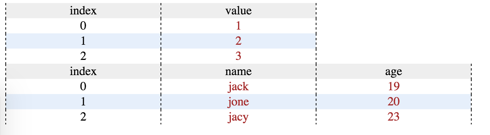

Conver array to table just like console.table()

## Usage

```
<head>
<link rel="stylesheet" type="text/css" href="array2Table.css">
</head>
<body>
	<div class="arrayTable"></div>
    <div class="arrayTable2"></div>
    
    <script src="array2Table.js"></script>
    <script type="text/javascript">
    arr1 = [1, 2, 3];
    arr2 = [{
        "name": "jack",
        "age": 19
    }, {
        "name": "jone",
        "age": 20
    }, {
        "name": "jacy",
        "age": 23
    }];
    var table1 = array2Table.createTable(arr1);
    var table2 = array2Table.createTable(arr2);
    array2Table.renderTable("arrayTable", table1);
    array2Table.renderTable("arrayTable2", table2);
    </script>
</body>
```



## need to do

Change it to JQuery extention.

Change css file to option.
